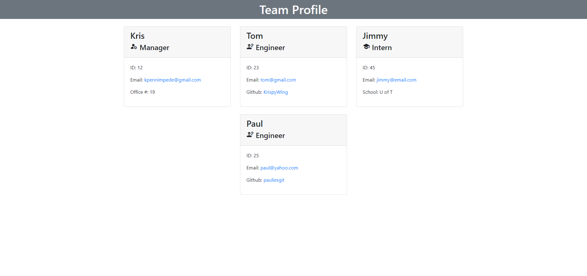

# Team Profile Generator

## Description
This is a Node.js app which will create a basic Team profile website based on some basic questions.
You will always start by creating a Manager and then can add as many Engineer or Intern team members as necessary.

## Table of Contents
* [Installation](#Installation)
* [Usage](#Usage)
* [Technologies](#Technologies)
* [Preview](#Preview)

## Installation
After copying the repository run "npm i" to install the necessary dependencies.

Questions use the Inquirer package.

Tests were created using jest.

## Usage
The program can be run from the command using node index.js.

Upon completion the created index.html file will be placed in the dist folder.

Object js files can be tested using the npm run test command. 

Currently there is a UnhandledPromiseReject error that occurs when you go to add the 3rd or subsequent member of the team. It does not affect the creation of the html page.

## Technologies
This progam was created using:

## Preview
Screenshot of HTML output

Demo of the program

[Walkthrough video link](https://drive.google.com/file/d/1q8T3ipjs6K2U2v_w0z12DqDavJa069fO/view?usp=sharing)